# Status Page Application - Cloud Architecture Diagram

## 🏗️ Detailed Cloud Architecture

```mermaid
graph TB
    %% Internet and Users
    Internet[🌐 Internet]
    Users[👥 Users]
    
    %% AWS Cloud
    subgraph AWS["☁️ AWS Cloud (us-west-2)"]
        %% VPC
        subgraph VPC["🏠 VPC (10.0.0.0/16)"]
            %% Internet Gateway
            IGW[🌐 Internet Gateway]
            
            %% Public Subnets
            subgraph PublicSubnets["🌍 Public Subnets"]
                ALB[⚖️ Application Load Balancer<br/>- HTTPS Termination<br/>- SSL/TLS<br/>- Health Checks]
                Jenkins[🔧 Jenkins Server<br/>- t3.small<br/>- CI/CD Pipeline<br/>- Docker + kubectl]
            end
            
            %% Private Subnets
            subgraph PrivateSubnets["🔒 Private Subnets"]
                %% EKS Cluster
                subgraph EKS["☸️ Amazon EKS Cluster"]
                    subgraph EKSNodes["🖥️ EKS Node Groups"]
                        subgraph SystemNodes["System Nodes (t3.medium)"]
                            IngressController[🌐 Nginx Ingress Controller]
                            Prometheus[📊 Prometheus]
                            Grafana[📈 Grafana]
                        end
                        subgraph AppNodes["Application Nodes (t3.medium/large)"]
                            StatusPagePods[📱 Status Page Pods<br/>- 3 replicas<br/>- Auto-scaling<br/>- Health checks]
                        end
                        subgraph SpotNodes["Spot Nodes (t3.large)"]
                            SpotPods[💰 Spot Pods<br/>- Non-critical workloads<br/>- 50-70% cost savings]
                        end
                    end
                end
                
                %% Database Subnets
                subgraph DatabaseSubnets["🗄️ Database Subnets"]
                    RDS[🐘 Amazon RDS PostgreSQL<br/>- db.t3.micro<br/>- Multi-AZ<br/>- Automated backups]
                    Redis[🔴 Amazon ElastiCache Redis<br/>- cache.t3.micro<br/>- Multi-AZ<br/>- Session storage]
                end
            end
            
            %% NAT Gateway
            NAT[🌉 NAT Gateway<br/>- Single instance<br/>- Cost optimization]
        end
        
        %% AWS Services
        subgraph AWSServices["🔧 AWS Services"]
            ECR[📦 Amazon ECR<br/>- Docker images<br/>- Private registry]
            S3[🪣 Amazon S3<br/>- Logs storage<br/>- Lifecycle policies]
            SecretsManager[🔐 AWS Secrets Manager<br/>- Database passwords<br/>- API keys]
            CloudWatch[📊 Amazon CloudWatch<br/>- Metrics<br/>- Logs<br/>- Alarms]
            SNS[📧 Amazon SNS<br/>- Alerts<br/>- Notifications]
        end
        
        %% Security
        subgraph Security["🔒 Security"]
            WAF[🛡️ AWS WAF<br/>- DDoS protection<br/>- OWASP rules]
            IAM[👤 AWS IAM<br/>- Roles & policies<br/>- Least privilege]
            KMS[🔑 AWS KMS<br/>- Encryption keys<br/>- Data protection]
        end
    end
    
    %% External Services
    subgraph External["🌍 External Services"]
        GitHub[📚 GitHub<br/>- Source code<br/>- CI/CD triggers]
        Slack[💬 Slack<br/>- Notifications<br/>- Alerts]
        Email[📧 Email<br/>- User notifications<br/>- Status updates]
    end
    
    %% Connections
    Users --> Internet
    Internet --> IGW
    IGW --> ALB
    ALB --> IngressController
    IngressController --> StatusPagePods
    
    %% Jenkins connections
    Jenkins --> GitHub
    Jenkins --> ECR
    Jenkins --> EKS
    Jenkins --> S3
    
    %% Database connections
    StatusPagePods --> RDS
    StatusPagePods --> Redis
    
    %% Monitoring connections
    StatusPagePods --> Prometheus
    Prometheus --> Grafana
    Prometheus --> CloudWatch
    CloudWatch --> SNS
    SNS --> Slack
    SNS --> Email
    
    %% Storage connections
    Jenkins --> S3
    CloudWatch --> S3
    
    %% Security connections
    ALB --> WAF
    RDS --> KMS
    Redis --> KMS
    S3 --> KMS
    
    %% Styling
    classDef aws fill:#ff9900,stroke:#232f3e,stroke-width:2px,color:#fff
    classDef compute fill:#4CAF50,stroke:#2E7D32,stroke-width:2px,color:#fff
    classDef database fill:#2196F3,stroke:#1565C0,stroke-width:2px,color:#fff
    classDef security fill:#F44336,stroke:#C62828,stroke-width:2px,color:#fff
    classDef monitoring fill:#9C27B0,stroke:#6A1B9A,stroke-width:2px,color:#fff
    classDef external fill:#607D8B,stroke:#37474F,stroke-width:2px,color:#fff
    
    class AWS,ECR,S3,SecretsManager,CloudWatch,SNS aws
    class EKS,StatusPagePods,Jenkins,ALB,IngressController compute
    class RDS,Redis database
    class WAF,IAM,KMS security
    class Prometheus,Grafana,CloudWatch monitoring
    class GitHub,Slack,Email,Internet,Users external
```

## 🏗️ Architecture Components

### **1. Compute Layer**
- **Amazon EKS**: Kubernetes cluster for container orchestration
- **Node Groups**: 
  - System nodes (t3.medium) for critical workloads
  - Application nodes (t3.medium/large) for the Status Page app
  - Spot nodes (t3.large) for cost optimization
- **Jenkins**: CI/CD server on EC2 (t3.small)

### **2. Data Layer**
- **Amazon RDS PostgreSQL**: Primary database (db.t3.micro, Multi-AZ)
- **Amazon ElastiCache Redis**: Caching and session storage (cache.t3.micro, Multi-AZ)

### **3. Network Layer**
- **VPC**: Isolated network environment (10.0.0.0/16)
- **Public Subnets**: Internet-facing resources (ALB, Jenkins)
- **Private Subnets**: Application and database resources
- **NAT Gateway**: Single instance for cost optimization

### **4. Security Layer**
- **AWS WAF**: Web application firewall
- **IAM**: Identity and access management
- **KMS**: Encryption key management
- **Security Groups**: Network-level security

### **5. Monitoring Layer**
- **Prometheus**: Metrics collection
- **Grafana**: Visualization and dashboards
- **CloudWatch**: AWS-native monitoring
- **SNS**: Alert notifications

### **6. Storage Layer**
- **Amazon S3**: Log storage with lifecycle policies
- **EBS**: Persistent storage for Jenkins
- **EFS**: Shared file storage (if needed)

## 💰 Cost Optimization Features

### **Infrastructure Optimizations**
- **Spot Instances**: 50-70% savings on non-critical workloads
- **Single NAT Gateway**: Reduced networking costs
- **Minimal Instance Sizes**: db.t3.micro, cache.t3.micro, t3.small
- **Auto Scaling**: Scale down during low usage
- **S3 Lifecycle**: Move old logs to cheaper storage

### **Monitoring Optimizations**
- **Basic CloudWatch**: Disabled detailed monitoring
- **Minimal Log Retention**: 7 days for most logs
- **Efficient Metrics**: Only essential metrics collected

### **Database Optimizations**
- **Minimal Storage**: 20GB with auto-scaling
- **Basic Backup**: 7-day retention
- **No Performance Insights**: Disabled for cost savings

## 🔒 Security Features

### **Network Security**
- **VPC Isolation**: Private subnets for sensitive resources
- **Security Groups**: Restrictive firewall rules
- **WAF Protection**: DDoS and OWASP protection

### **Data Security**
- **Encryption at Rest**: All data encrypted with KMS
- **Encryption in Transit**: TLS 1.3 for all communications
- **Secrets Management**: AWS Secrets Manager for sensitive data

### **Access Control**
- **IAM Roles**: Least privilege access
- **Multi-Factor Authentication**: Required for admin access
- **Regular Audits**: Automated security scanning

## 📊 Monitoring & Observability

### **Application Monitoring**
- **Health Checks**: Kubernetes liveness and readiness probes
- **Metrics**: Prometheus for custom application metrics
- **Logs**: Centralized logging with CloudWatch

### **Infrastructure Monitoring**
- **CloudWatch**: AWS resource metrics
- **Grafana**: Unified monitoring dashboard
- **Alerts**: SNS notifications for critical issues

### **Performance Monitoring**
- **Response Times**: 95th percentile tracking
- **Error Rates**: 4xx and 5xx error monitoring
- **Resource Usage**: CPU, memory, and network metrics

## 🚀 Deployment Flow

1. **Code Push**: Developer pushes to GitHub
2. **Jenkins Trigger**: Webhook triggers Jenkins pipeline
3. **Build & Test**: Docker image build and testing
4. **Push to ECR**: Image pushed to Amazon ECR
5. **Deploy to EKS**: Kubernetes deployment updated
6. **Health Check**: Automated health verification
7. **Monitoring**: Continuous monitoring and alerting

## 📈 Scalability Features

- **Horizontal Pod Autoscaling**: Based on CPU and memory
- **Cluster Autoscaling**: Automatic node scaling
- **Load Balancing**: ALB with health checks
- **Multi-AZ**: High availability across zones
- **Auto Scaling Groups**: EKS node group scaling

This architecture provides a production-ready, scalable, and cost-optimized solution for the Status Page application while maintaining high availability and security standards.
